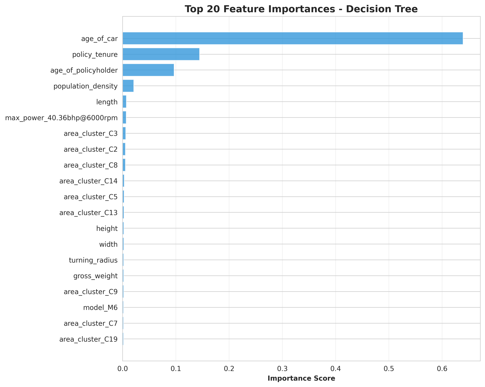
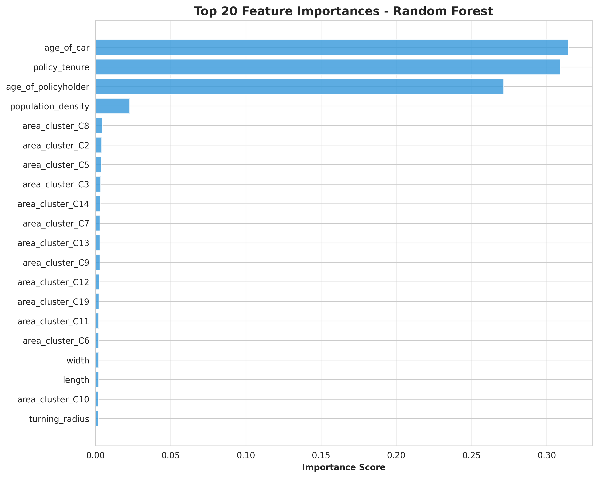
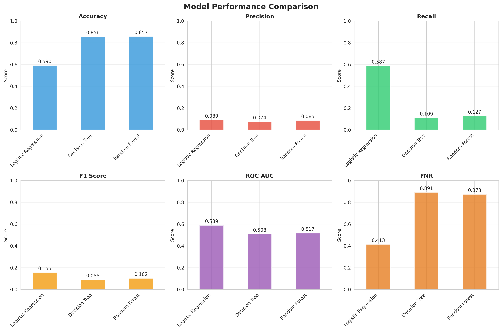
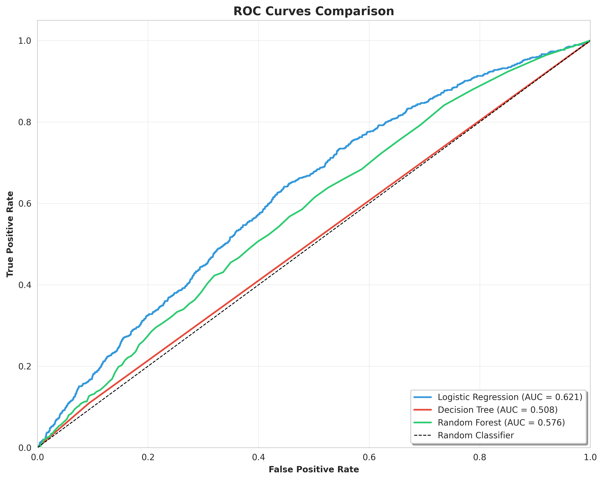

# Insurance Claim Prediction Pipeline

## 📌 Project Overview

This project implements a robust, modular machine learning pipeline designed to predict insurance policy claims. It has been significantly refactored to adhere to **SOLID principles**, offering a highly configurable environment for experimenting with different sampling strategies, scaling techniques, and classification models.

Unlike standard scripts, this pipeline uses **Factory and Strategy design patterns** to allow users to swap algorithms (e.g., switching from SMOTE to ADASYN or Standard Scaling to MinMax) via configuration, without modifying the codebase.

## 🚀 Key Features & Capabilities

### 1. Advanced Imbalance Handling (Strategy Pattern)

The pipeline addresses the inherent class imbalance in insurance data using a configurable Strategy pattern. You are no longer limited to simple random sampling.

* **Supported Strategies:**
* `smote` (Synthetic Minority Over-sampling Technique) - *Default*
* `adasyn` (Adaptive Synthetic Sampling)
* `random` (Random Over-sampling)
* `none` (No sampling)


* **Leakage Prevention:** Resampling is applied *strictly* to the training set after the train/test split.

### 2. Flexible Feature Scaling

Feature scaling is decoupled from the modeling logic.

* **Supported Scalers:** Standard Scaler, MinMax Scaler, Robust Scaler.

### 3. Modular Model Management (Factory Pattern)

Models are instantiated via a `ModelFactory`, allowing for easy extension.

* **Current Models:** Logistic Regression, Decision Tree, Random Forest.
* **Extensibility:** New models (e.g., XGBoost, SVM) can be registered in `src/model_factory.py` without breaking the pipeline.

### 4. Comprehensive Visualization

The `MatplotlibVisualizer` automatically generates insightful plots to evaluate model performance:

* **ROC Curves:** Compare AUC across all models.
* **Confusion Matrices:** Visualizes False Positives/Negatives with percentage breakdowns.
* **Feature Importance:** Automatically generated for tree-based models.
* **Class Distribution:** Visualizes the impact of the selected sampling strategy (Before vs. After).
* **Performance Comparison:** Side-by-side bar charts for Accuracy, Precision, Recall, F1, and FNR.

### 5. Centralized Configuration

All pipeline behaviors—features to encode, hyperparameters, and sampling methods—are controlled via `src/config.py`.

## 📂 Project Structure

```text
insurance_claim_prediction/
├── data/                  # CSV Data source
├── src/
│   ├── config.py          # Master config (Features, Pipeline, Models)
│   ├── interfaces.py      # Abstract Base Classes (Contracts)
│   ├── model_factory.py   # Factory for creating model instances
│   ├── sampling_strategy.py # Strategy pattern for SMOTE/ADASYN/Random
│   ├── scaler_factory.py  # Factory for scaling logic
│   ├── pipeline.py        # Orchestrator (Split -> Scale -> Resample -> Train)
│   ├── preprocessor.py    # Feature engineering (One-Hot, Ordinal, Cleaning)
│   ├── visualizer.py      # Plot generation logic
│   └── main.py            # CLI Entry point
├── visualizations/               # Generated plots (created at runtime)
├── tests/                 # Unit tests
├── requirements.txt       # Dependencies
└── run.sh                 # Automation script

```

## ⚙️ Configuration

You can customize the pipeline behavior by modifying `src/config.py`.

**Example: Changing Sampling to ADASYN**

```python
@dataclass
class PipelineConfig:
    enable_oversampling: bool = True
    oversampling_method: str = "adasyn"  # Options: smote, random, adasyn

```

**Example: Tuning Model Hyperparameters**

```python
@dataclass
class ModelConfig:
    random_forest: Dict[str, any] = field(default_factory=lambda: {
        "n_estimators": 200,      # Increased from default
        "max_depth": 10,
        "class_weight": "balanced"
    })

```

You can add models in the comparison test by adding them to `src/config.py` & `src/model_factory.py`. A sample has been added for reference as comments in the respective files.

## 🛠️ Installation & Usage

### Prerequisites

* Python 3.8+
* Virtual Environment (recommended)
* Data formatted as per the column names in `src/config.py` [since the columns are configurable, you can alter the column names in the config file instead]

### Manual Execution (CLI)

The `main.py` entry point supports command-line arguments to control visualization output.

```bash
# Run pipeline and generate visualizations (default)
python src/main.py

# Run pipeline without generating plots (faster)
python src/main.py --no-viz

# Save visualizations to a custom directory
python src/main.py --viz-dir my_custom_plots/

```

You should see console output steps (loading, preprocessing, training) and a final DataFrame with metrics for each model as shown below.
```
1. Loading Data...
2. Preprocessing...
3. Splitting Data...
4. Handling Imbalance (Training Set Only)...
5. Scaling Features...
6. Training & Evaluating: Logistic Regression...
6. Training & Evaluating: Decision Tree...
6. Training & Evaluating: Random Forest...

==================================================
FINAL MODEL PERFORMANCE
==================================================
                     Accuracy  Precision  Recall  F1_Score   ROC_AUC    FNR
Model                                                                      
Logistic Regression  0.572745   0.090594   0.628  0.158346  0.598484  0.372
Decision Tree        0.879427   0.079848   0.084  0.081871  0.508907  0.916
Random Forest        0.913986   0.078431   0.032  0.045455  0.503146  0.968
==================================================
```

**Generating Visualizations**
- By default `src/main.py` will create visualizations and save them into `visualizations/`.
- To disable visualizations: `python src/main.py --no-viz`
- To customize output directory: `python src/main.py --viz-dir my_plots/`
- Sample plots are already included in `visualizations/` (ROC curves, confusion matrices, feature importance, performance comparison, class distribution).








### Input Data

Ensure your data is placed in the `data/` folder. The default expected filename is `train_data.csv`, which can be changed in `src/config.py`.

## 📊 Pipeline Logic

1. **Data Loading:** Ingests CSV data.
2. **Preprocessing:**
* Drops identifier columns (e.g., `policy_id`).
* Converts Yes/No columns to Boolean.
* Applies **Ordinal Encoding** to `ncap_rating`.
* Applies **One-Hot Encoding** to categorical fields (make, fuel_type, etc.).


3. **Splitting:** Stratified Train/Test split.
4. **Resampling (Train set only):** Applies the configured strategy (e.g., SMOTE) to balance classes.
5. **Scaling:** Normalizes features using the configured Scaler.
6. **Training & Evaluation:** Trains all enabled models and calculates metrics (Accuracy, F1, ROC-AUC, FNR).
7. **Visualization:** Saves performance artifacts to disk.

## 🔮 Future Roadmap

1. Export configurations to a YAML or JSON config file
2. Update test to accomodate the added functionaliy
3. Imporve logging capabilites
